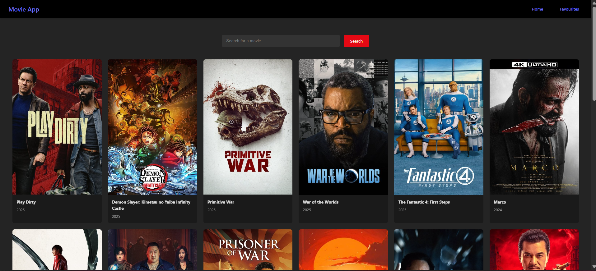

# React Movie Search App 🎬

A movie search web app built using React and The Movie Database (TMDb) API.  
You can view popular movies, search by movie name, and add/remove favorites — stored in local storage.

This project is based on the tutorial video *“Learn React With This ONE Project”* by Web Dev Simplified. :contentReference[oaicite:0]{index=0}

---

## 🖼️ Screenshot


## 🚀 Features

- Fetch and display **popular movies** on initial load  
- Search for movies by title  
- Add/Remove movies to/from **favorites**  
- Persist favorites in **local storage**  
- Responsive grid layout for movie cards  
- Favorite button overlay on movie posters  

---

## 🧱 Tech Stack

| Layer | Technologies / Libraries |
|---|---|
| Frontend | React, React Hooks (useState, useEffect, useContext) |
| State Management | React Context API (for favorites) |
| API | The Movie Database (TMDb) API |
| Routing | react-router-dom |
| Styling | CSS (custom) |
| Deployment | (You can deploy to Netlify, Vercel, GitHub Pages, etc.) |

---

## 🏗️ Project Structure

```
src/
├── App.jsx
├── main.jsx
├── index.html
├── services/
│ └── api.js
├── contexts/
│ └── MovieContext.jsx
├── pages/
│ └── Home.jsx
├── components/
│ └── MovieCard.jsx
├── css/
│ ├── Home.css
│ ├── MovieCard.css
│ └── index.css
└── README.md
```


**Important files & their roles:**

- `api.js` — handles API requests to TMDb (popular & search endpoints)  
- `MovieContext.jsx` — provides favorites state and functions globally  
- `Home.jsx` — search input, API calls, movie grid  
- `MovieCard.jsx` — displays each movie + favorite button  
- `App.jsx` & `main.jsx` — app setup, routing, and context provider wrap  

---

## 🧩 How It Works

1. On initial load, `Home.jsx` uses `getPopularMovies()` to fetch popular movies via TMDb API and displays them.  
2. When the user types a search term and submits, `searchMovies(query)` is called to fetch matching results.  
3. The results replace the current movie list in state, and the UI re-renders.  
4. Each `MovieCard` gets user’s favorite status via context (`isFavorite(movie.id)`) and shows a “♥” button.  
5. Clicking the button toggles the movie in favorites by calling `addToFavorites` or `removeFromFavorites`.  
6. Favorites are saved to `localStorage` automatically via `useEffect`.

---

## 🛠️ How to Run Locally

1. Clone the repository  
   ```bash
   git clone <your-repo-url>
   cd <repo-folder>
   ```

2. Install dependencies
```
npm install
```

3. Start development server
```
npm run dev
```

---

## Additional Learnings

- component: is any function in js that returns a java script code. starts with capital.
- fragment: <></>
- props (property): 
- conditional rendering: 
- state: once it updated, the component will change and re render itself to show the new state.
- hook:
- useEffect: allows us to add side effects to our functions or to your components and define when they should run.
- context: will allow state to be globally awailable to anything that's within the provided context.
- children: a reserver prop when we write a component and children is anything that's inside the component that we entered.
-- example: browserRouter -> App

